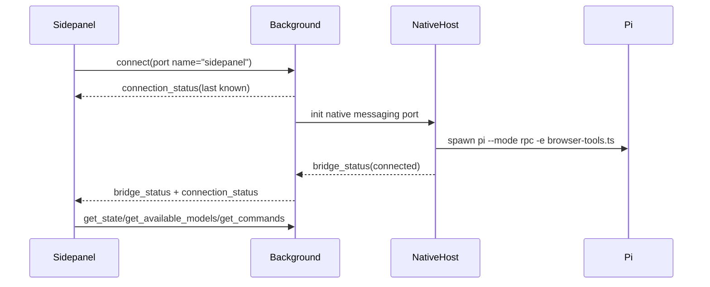
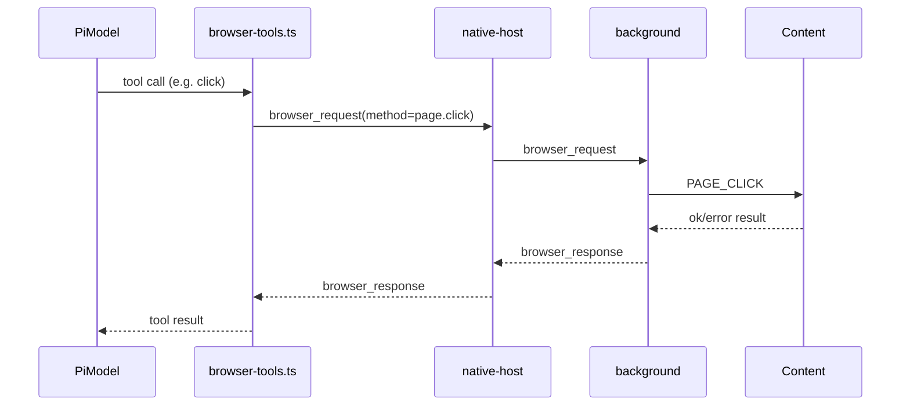
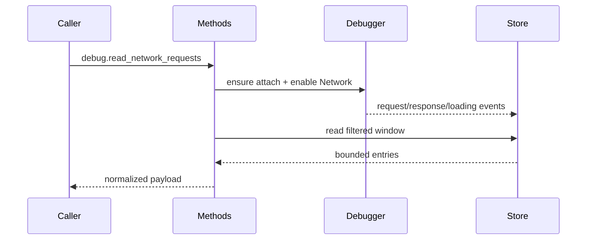
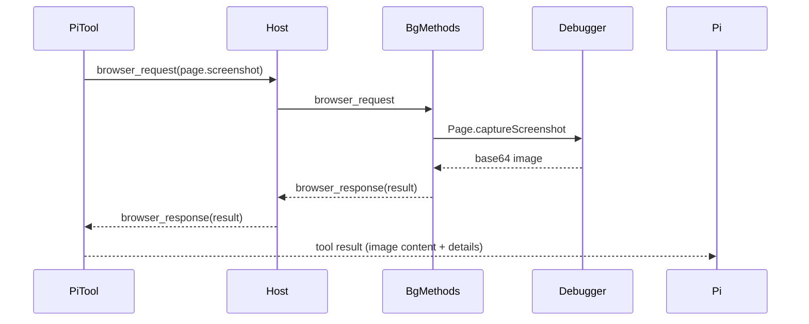

# Protocol Index and Runtime Sequences

Date: 2026-02-28

This document complements `docs/architecture/system-communication-map.md`.
It is a protocol-oriented index: what message families exist, where each is declared, who emits them, and who consumes them.

No code snippets are included by design.

---

## 1) Protocol surfaces

## 1.1 Pi RPC surface

Primary docs and type anchors:
- Canonical documentation: `node_modules/@mariozechner/pi-coding-agent/docs/rpc.md`
- Frontend import surface: `src/sidepanel/pi-rpc-types.ts`

Used by:
- `src/sidepanel/hooks/use-pi-agent.ts`
- `native-host/host.cjs` (pass-through between Chrome and pi process)

Core shape:
- Commands (`RpcCommand`)
- Responses (`RpcResponse`)
- Agent/session stream events (`RpcAgentEvent`)
- Extension UI requests/responses

---

## 1.2 Browser RPC surface

Primary type anchor:
- `src/common/browser-rpc.ts`

Used by:
- Tool extension: `pi-extension/browser-tools.ts`
- Background dispatcher: `src/background/main.ts`
- Browser handlers: `src/background/browser-methods.ts`
- Native host allowlist and broker: `native-host/host.cjs`

Core shape:
- `BrowserRequest`: `(type, id, method, params)`
- `BrowserResponse`: `(type, id, ok, result|error)`

---

## 1.3 Content command surface

Primary anchor:
- `src/content/main.ts`

Used by:
- Background browser methods, via tab messaging

Core shape:
- `PAGE_*` command messages with typed payload subsets

---

## 2) Browser method inventory by domain

Source of truth:
- `src/common/browser-rpc.ts` (method union + array)

### 2.1 Tabs domain
- list/current/get/context/create/activate/close/update/go_back/go_forward/reload

### 2.2 Page domain
- get_text/read/find/click/type/form_input/scroll/key/hover/file_upload/upload_image/gif_creator/javascript_exec/screenshot

### 2.3 Debug domain
- read_console_messages/read_network_requests

### 2.4 Session helper domain
- sessions.list/sessions.switch

Cross-check point:
- Native host allowlist in `native-host/host.cjs` must include every method that should traverse socket bridge.

---

## 3) Event categories consumed by sidepanel hook

Consumer:
- `src/sidepanel/hooks/use-pi-agent.ts`

### 3.1 Connectivity and bridge
- `connection_status`
- `bridge_status`
- `bridge_error`

### 3.2 Agent lifecycle
- `agent_start`
- `agent_end`
- `turn_start`
- `turn_end`

### 3.3 Message stream
- `message_start`
- `message_update` (delta stream)
- `message_end`

### 3.4 Tool lifecycle
- `tool_execution_start`
- `tool_execution_update`
- `tool_execution_end`

### 3.5 Retry/compaction
- `auto_retry_start`
- `auto_retry_end`
- `auto_compaction_start`
- `auto_compaction_end`

### 3.6 Extension UI
- `extension_ui_request` with methods:
  - select/confirm/input/editor
  - notify
  - setStatus
  - setWidget
  - setTitle
  - set_editor_text
- `extension_error`

### 3.7 Generic command responses
- `response`

---

## 4) Command categories emitted by sidepanel hook

Emitter:
- `src/sidepanel/hooks/use-pi-agent.ts`

### 4.1 Prompting and control
- prompt
- abort
- steer
- follow_up

### 4.2 State/model metadata
- get_state
- get_available_models
- get_commands
- set_model
- cycle_model

### 4.3 Session stats
- get_session_stats

### 4.4 Extension UI reply
- extension_ui_response

### 4.5 Local slash parsing behavior
- Local command parser resolves some slash paths to RPC commands (`/commands`, `/models`, `/model`, `/provider`)
- Unknown slash paths are passed through for extension/prompt/skill resolution by pi

---

## 5) Transport channels and framing

## 5.1 Sidepanel <-> Background
- Transport: `chrome.runtime.Port`
- Format: JS objects (structured clone)
- Multiplexes both RPC plane and ad-hoc envelopes

## 5.2 Background <-> Native host
- Transport: Chrome Native Messaging
- Framing: 4-byte little-endian length + JSON payload

## 5.3 Native host <-> Pi process
- Transport: stdin/stdout
- Framing: line-delimited JSON (JSONL)

## 5.4 Pi extension tools <-> Native host
- Transport: Unix domain socket (`/tmp/pi-chrome-bridge.sock` by default)
- Framing: line-delimited JSON

---

## 6) Sequence diagrams by concern

### 6.1 Initial bootstrap sequence

### 6.2 Tool execution sequence (DOM action)

### 6.3 Debug capture sequence

### 6.4 Screenshot sequence

---

## 7) Bounded stores and caps

### 7.1 Host-level caps (`native-host/host.cjs`)
- Max native message size
- Max in-flight browser requests
- Browser request timeout

### 7.2 Debug event caps (`src/background/debug-events.ts`)
- Max console entries per tab
- Max network entries per tab
- String/url truncation limits

### 7.3 Tool output caps
- Browser tool side truncation for large JSON text payloads
- Screenshot omission behavior when payload exceeds configured threshold in background method

---

## 8) Correlation IDs and request matching

### 8.1 Pi RPC command IDs
- Sidepanel attaches generated IDs on outgoing RPC commands
- Responses matched by command semantics in hook logic

### 8.2 Browser RPC IDs
- `browser_request.id` generated by caller
- Matched in:
  - native host pending request map
  - background responses
  - socket client in pi extension tools

### 8.3 Tool execution IDs in UI
- `toolCallId` used to reconcile streaming tool lifecycle updates in sidepanel state

---

## 9) Reliability and status signaling surfaces

### 9.1 Bridge status surfaces
- Native port manager emits connected/disconnected/error
- Background forwards connection status to sidepanel clients
- Sidepanel renders transient status and persistent indicators

### 9.2 Error signaling
- Browser RPC uses `ok=false` + `error`
- Pi tool results can mark error state
- Sidepanel maps `event.isError` from tool lifecycle events to tool status chips

### 9.3 Reconnect behavior
- Native messaging reconnect loop in port manager
- Sidepanel reconnection tied to runtime port lifecycle

---

## 10) Files to keep open while rebuilding

For communication architecture:
- `native-host/host.cjs`
- `src/background/main.ts`
- `src/common/browser-rpc.ts`
- `src/background/browser-methods.ts`
- `src/native/port-manager.ts`
- `src/sidepanel/hooks/use-pi-agent.ts`
- `pi-extension/browser-tools.ts`

For execution semantics:
- `src/content/main.ts`
- `src/content/interaction-engine.ts`
- `src/content/read-page.ts`
- `src/background/debug-events.ts`

For protocol reference:
- `node_modules/@mariozechner/pi-coding-agent/docs/rpc.md`

---

## 11) Notes from cross-check passes

- Oracle pass emphasized the two-plane model and bridge centrality (`host.cjs` + background SW) as the dominant architecture concept.
- Reviewer tool was invoked for independent structural check; tool response returned as an image payload in this environment, so this index prioritizes direct code + oracle synthesis.
