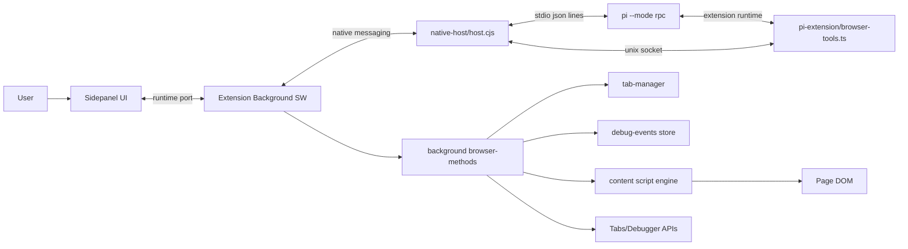
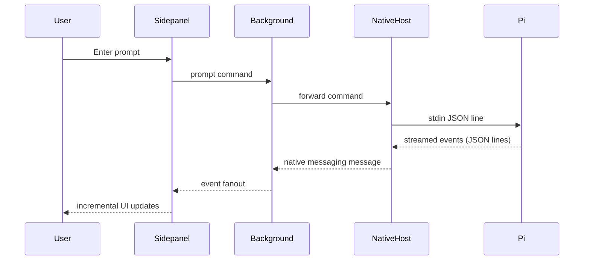
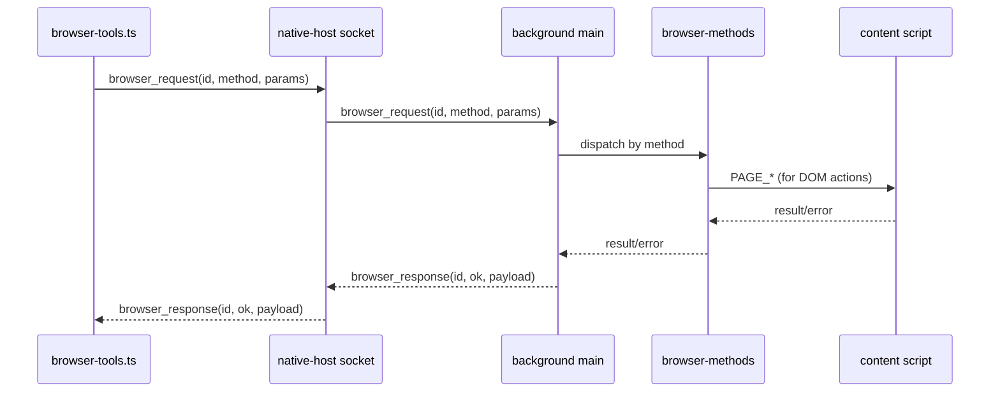
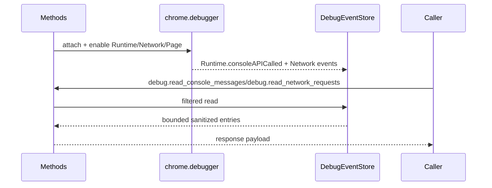

# Pi Chrome Architecture Map

Date: 2026-02-28
Scope: current codebase behavior and runtime topology

This document is a structural map of the system as it exists now. It focuses on runtime boundaries, communication channels, message families, and responsibilities of each module.

It is intentionally descriptive. It does not prescribe implementation changes.

---

## 1) Big sections of the system

At a high level, the project has two intersecting planes:

1. **Agent/Session RPC plane**
   - Handles prompts, model/session state, streaming assistant events, tool lifecycle events, slash command metadata, and extension UI events.
   - Main protocol type source on frontend: `src/sidepanel/pi-rpc-types.ts`
   - Canonical protocol docs: `node_modules/@mariozechner/pi-coding-agent/docs/rpc.md`

2. **Browser Automation RPC plane**
   - Handles tab/page/debug/tool execution methods using request-response semantics with correlation IDs.
   - Contract source: `src/common/browser-rpc.ts`
   - Methods executed in extension background + content scripts + debugger APIs.

Both planes are bridged by the native host process (`native-host/host.cjs`) and the extension background service worker (`src/background/main.ts`).

---

## 2) Runtime components and boundaries

### 2.1 Sidepanel UI (React)

Primary modules:
- `src/sidepanel/App.tsx`
- `src/sidepanel/hooks/use-pi-agent.ts`
- `src/sidepanel/pi-rpc-types.ts`
- `src/sidepanel/types.ts`
- Visual components in `src/sidepanel/components/*`

Responsibilities:
- Open a runtime port to the extension background (`port.name = "sidepanel"`)
- Send RPC commands/prompts
- Consume streamed events and project them into UI state
- Keep local state for message stream, tool execution timeline, model/session metadata, status banners
- Handle extension UI requests (`notify`, `select`, `confirm`, etc.)

Boundary:
- Trusts background as transport peer
- Treats incoming messages as runtime events; event typing is client-side asserted

---

### 2.2 Extension Background Service Worker

Primary module:
- `src/background/main.ts`

Responsibilities:
- Connection hub between sidepanel clients and native host
- Multiplex/de-multiplex messages:
  - sidepanel -> native host
  - native host -> all connected sidepanels
- Execute `browser_request` messages by dispatching to method handlers
- Return `browser_response`

Boundary:
- Has Chrome privileged APIs
- Is the execution authority for browser methods

---

### 2.3 Browser Method Execution Layer

Primary modules:
- `src/background/browser-methods.ts`
- `src/background/tab-manager.ts`
- `src/background/debug-events.ts`
- `src/background/session-manager.ts`

Responsibilities:
- Validate and normalize params for each browser method
- Execute browser operations via:
  - Tabs/Windows APIs
  - Content script message calls
  - Chrome Debugger protocol
- Maintain debugger attachment lifecycle and debug event store
- Return normalized result/error objects

Boundary:
- Bridges from abstract RPC methods to concrete Chrome APIs
- Handles many operational failure modes (non-scriptable URLs, stale refs, debugger conflicts)

---

### 2.4 Content Script Execution Engine

Primary modules:
- `src/content/main.ts`
- `src/content/interaction-engine.ts`
- `src/content/read-page.ts`

Responsibilities:
- Receive `PAGE_*` command messages from background
- Perform DOM reads/queries/interactions
- Maintain stable element reference model
- Surface deterministic operational errors (stale refs, hidden/disabled target, unsupported target)

Boundary:
- Runs in page context
- Interacts with untrusted, mutable DOM

---

### 2.5 Native Messaging Port Manager (extension-side)

Primary module:
- `src/native/port-manager.ts`

Responsibilities:
- Establish `chrome.runtime.connectNative("dev.pi.chrome.bridge")`
- Auto-reconnect on disconnect
- Forward outbound messages to native host

Boundary:
- Browser extension process to OS-level native host process

---

### 2.6 Native Host Bridge Process

Primary module:
- `native-host/host.cjs`

Responsibilities:
- Speak Chrome Native Messaging framed protocol
- Spawn and supervise `pi --mode rpc` process
- Forward non-browser-response messages to pi stdin
- Forward pi stdout JSON lines to Chrome
- Host Unix socket server for tool-side browser RPC
- Broker `browser_request`/`browser_response` with timeout and in-flight limits
- Enforce allowlist for browser method names

Boundary:
- Cross-process transport and policy boundary
- Last hop before/after pi runtime

---

### 2.7 Pi Extension Tool Layer (inside pi process)

Primary module:
- `pi-extension/browser-tools.ts`

Responsibilities:
- Register tools visible to the model
- Filter active tool set
- Define browser-focused system prompt
- For each tool, call bridge socket with `browser_request`
- Convert responses into tool result payloads (text/image/error)

Boundary:
- Lives inside pi runtime
- Converts model-level tool calls to browser RPC payloads

---

## 3) End-to-end communication topology

Observations:
- There are two paths to browser methods:
  1) From model tools via pi extension socket
  2) From sidepanel-generated browser requests via background/native path
- `native-host/host.cjs` is the central broker that touches both planes.

---

## 4) Message families and where they are defined

### 4.1 Pi RPC command/response/events

Primary references:
- Type imports in UI: `src/sidepanel/pi-rpc-types.ts`
- Canonical docs: `node_modules/@mariozechner/pi-coding-agent/docs/rpc.md`

Important command categories in this app usage:
- Prompt control (`prompt`, `abort`, `steer`, `follow_up`)
- State/model metadata (`get_state`, `get_available_models`, `set_model`, `cycle_model`)
- Command metadata (`get_commands`)
- Session stats (`get_session_stats`)
- Session switch (`switch_session`) is available in pi RPC docs

Event categories consumed by UI hook:
- Connection/bridge status events
- Agent lifecycle events
- Message streaming delta events
- Tool execution lifecycle events
- Auto retry/compaction events
- Extension UI request events
- Generic RPC `response`

---

### 4.2 Browser RPC request/response

Primary references:
- Contract: `src/common/browser-rpc.ts`

Envelope:
- Request: `type`, `id`, `method`, `params`
- Response: `type`, `id`, `ok`, `result|error`

Method groups currently enumerated:
- Tab methods (`tabs.*`)
- Page methods (`page.*`)
- Debug methods (`debug.*`)
- Session helper methods (`sessions.*`)

Execution dispatch:
- Background validates method against `BROWSER_METHODS`
- Native host separately enforces allowlist (`ALLOWED_METHODS`)

---

## 5) Dataflow sequences

### 5.1 User prompt to streamed assistant output

---

### 5.2 Model tool call to browser method execution

---

### 5.3 Debug observability path

---

## 6) Contract boundaries and trust zones

### Zone A: Sidepanel UI
- User-entered text and slash commands
- UI state reconstruction from event stream

### Zone B: Extension background
- Privileged execution rights
- Validates browser method envelopes before execution

### Zone C: Native host process
- Cross-process framing + forwarding
- Broker and allowlist enforcement

### Zone D: Pi process + extension tools
- Model interaction + tool registration
- Browser RPC via socket

### Zone E: Page DOM / remote content
- Untrusted, volatile runtime target
- Must expect stale references and dynamic mutations

---

## 7) Operational constraints currently encoded

In native host:
- Max native message size: 1MB (Chrome limit guard)
- Browser request timeout for socket requests
- Max in-flight browser requests
- Method allowlist hard gate

In background/browser methods:
- Scriptable URL checks for debugger operations
- Structured parameter validation helpers
- Explicit error messages for unavailable content script receiver

In content/interaction engine:
- Ref resolution and stale detection
- Visibility/disabled checks
- Input capability checks per element type

In debug store:
- Entry caps per tab
- Sensitive text redaction and truncation

---

## 8) Session-related architecture

There are three different session concepts in play:

1. **Pi session runtime state**
   - Obtained via `get_state` and `get_session_stats` RPC
   - Includes current session id/name/file, model, thinking level, message counts

2. **Sidepanel local UI session state**
   - React state for messages, tools, notices, extension UI state
   - Rehydrated from event stream and command responses

3. **Filesystem session catalog helper**
   - `src/background/session-manager.ts` scans `~/.pi/agent/sessions`
   - Produces list metadata for UI/session-picker style workflows

These are related but not identical responsibilities.

---

## 9) Where to find event and command inventories

For exhaustive Pi RPC command/event definitions:
- `node_modules/@mariozechner/pi-coding-agent/docs/rpc.md`
- `src/sidepanel/pi-rpc-types.ts` (project’s imported type surface)

For browser method inventories:
- `src/common/browser-rpc.ts` (`BrowserRpcMethod`, `BROWSER_METHODS`)
- `native-host/host.cjs` (`ALLOWED_METHODS`)
- `src/background/browser-methods.ts` (actual method handler map)

For content command inventories:
- `src/content/main.ts` (`PAGE_*` message union)

---

## 10) Key complexity concentrations (for rewrite planning context)

These are not recommendations; they are where complexity currently accumulates:

1. **Dual-plane routing in one bridge process** (`host.cjs`)
2. **Cross-boundary request correlation** (`id`-based handling in multiple hops)
3. **State reconstruction from streamed events** (`use-pi-agent.ts`)
4. **Multiple transport protocols at once**
   - runtime port
   - native messaging framed protocol
   - stdio json lines
   - unix socket json lines
5. **Mixed browser execution backends** (tabs/content/debugger)

---

## 11) Independent analysis sources used

- Local code inspection across sidepanel/background/content/native host/pi extension modules
- Oracle architecture pass over core files
- Reviewer run was invoked for diff-level architectural risks; result returned as image payload in tool channel, so the structural synthesis here prioritizes direct code and oracle findings

---

## 12) Glossary

- **Pi RPC plane**: command/event stream between UI and pi runtime
- **Browser RPC plane**: request/response method execution for browser operations
- **Native host**: OS process that brokers Chrome extension and pi process
- **Background SW**: Chrome extension service worker with privileged browser API access
- **Content script**: page-context executor for DOM interactions
- **Tool extension**: pi plugin that registers model-callable browser tools
